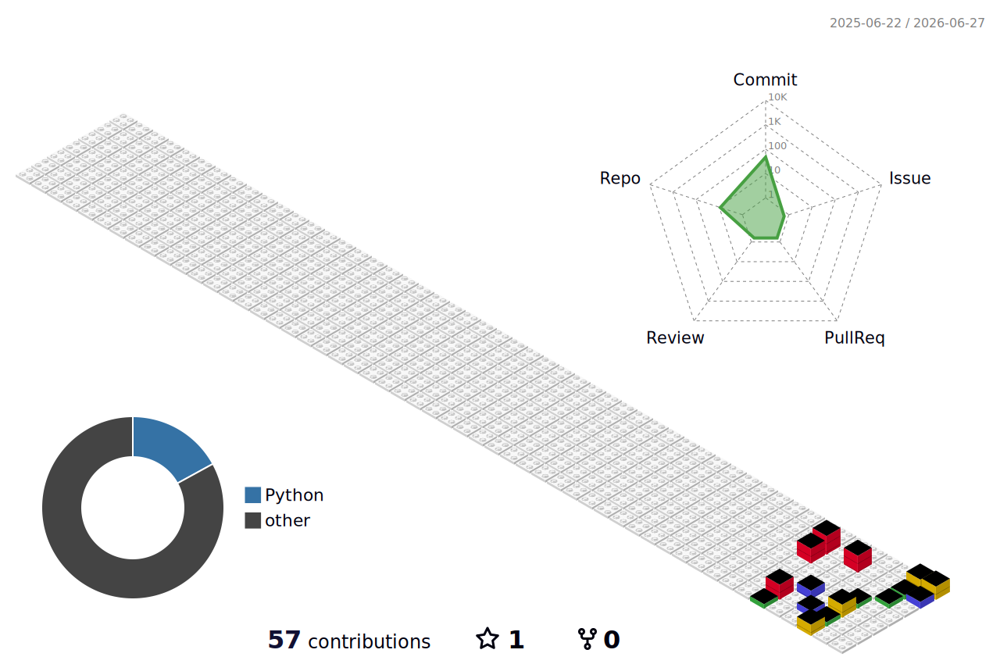

<div align="center">


<br/>

[](https://www.kali.org/)
[](/)
[](/)
[](/)

</div>


## `whoami`

```
┌──(ogore㉿kali)-[~]
└─$ whoami

  Name        :  Isaiah Ogore Samwa
  Background  :  Electrical & Electronics Engineering
  Mission     :  Hardware & IoT Penetration Tester
  Approach    :  100% free resources | Learning in public
  Strength    :  Physical layer · Circuits · Embedded systems
  Status      :  Actively building — no shortcuts, no backdoors
```


## `cat /etc/objectives`

```
┌──(ogore㉿kali)-[~]
└─$ cat objectives.txt

  [✔] Deploy Kali Linux — bare metal (primary OS)
  [▶] Linux Fundamentals    →  HTB Academy + OverTheWire: Bandit
  [▶] Networking            →  Professor Messer N10-009 + Cisco NetAcad
  [▶] Cybersecurity Cert    →  Mediacrest Training College (in progress)
  [ ] Python Scripting      →  CS50P + Automate the Boring Stuff
  [ ] Certifications        →  Network+ → Security+ → eJPT → OSCP → GICSP
  [ ] Hardware & IoT Pentest →  The end goal
```


## Learning Roadmap

<div align="center">

| # | Stage | Resources | Status |
|---|-------|-----------|--------|
| 1 | Linux | OverTheWire: Bandit · HTB Academy · Linux Journey |  In Progress |
| 2 | Networking | Professor Messer N10-009 · Cisco NetAcad |  In Progress |
| 3 | Cybersecurity Foundations | Mediacrest Training College |  In Progress |
| 4 | Python | CS50P · Automate the Boring Stuff |  Up Next |
| 5 | Hardware & IoT Pentesting | Labs · VulnHub · HackTheBox |  Goal |

</div>


## `ls ~/arsenal`

**Electrical Engineering Background**


**Currently Learning**


**Cybersecurity Stack**


**Tools — Active Use**


## HackTheBox Stats

<div align="center">


</div>


## GitHub Stats

<div align="center">


<br/>


</div>


## 3D Contribution Graph

<div align="center">



</div>


## Metrics

<div align="center">


</div>


## Contribution Snake

<div align="center">

<picture>
  <source media="(prefers-color-scheme: dark)" srcset="https://raw.githubusercontent.com/ogore-samwa/ogore-samwa/output/github-contribution-grid-snake-dark.svg" />
  <source media="(prefers-color-scheme: light)" srcset="https://raw.githubusercontent.com/ogore-samwa/ogore-samwa/output/github-contribution-grid-snake.svg" />
  
</picture>

</div>


## Featured Project

<div align="center">

[](https://github.com/ogore-samwa/ghost-protocol)

[](https://github.com/ogore-samwa/ctf-writeups)

</div>

> `ghost-protocol` — Public log of my cybersecurity self-study: notes, writeups, and progress from zero to hardware pentester.
>
> `ctf-writeups` — CTF challenge solutions with methodology, flags, and concepts learned.


## Connect

<div align="center">

[](https://github.com/ogore-samwa)
[](https://profile.hackthebox.com/profile/019e8a23-17dd-71bb-812e-135fe9d94618)
[](mailto:samogore8@gmail.com)

</div>


<div align="center">

```
[ access granted ] — root@circuitshield
```

*"The quieter you become, the more you are able to hear." — Kali Linux*

<br/>


</div>
